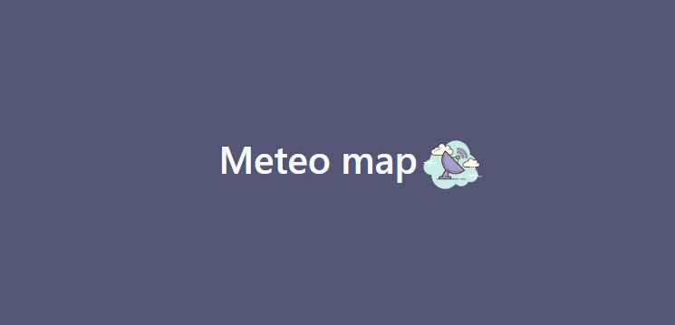

<a name="readme-top"></a>

<br />
<div align="center">
  <a href="https://github.com/DavidPrDev/meteoMap-1.2">
    
  </a>

  [](https://www.linkedin.com/in/david-pérez-romero-b8a57a292/)

  <h3 align="center">Meteo map</h3>
  <p align="center">
         
  </p>
      <a href="https://meteomap.david-pr.com/">Visita la web </a>
</div>

<details>
  <summary>Contenido de la aplicación</summary>
  <ol>
    <li>
      <a href="#Sobre-el-proyecto">Sobre el proyecto</a>
      <ul>
        <li><a href="#Tecnologías-empleadas">Tecnologías</a></li>
      </ul>
    </li>
    <li>
      <a href="#Empezando">Empezando</a>
      <ul>
        <li><a href="#Prerrequisitos">Prerrequisitos</a></li>
        <li><a href="#Backend"> Instalacion Backend </a>
        <li><a href="#Frontend"> Instalacion Frontend </a>
        <li><a href="#Características-del-proyecto">Caracteristicas</a></li>
      </ul>
    </li>
   
  </ol>
</details>


<!-- ABOUT THE PROJECT -->
## Sobre el proyecto 


Meteomap es una aplicación meteorológica construida en laravel y react como frontal ,consumiendo la API rest de <a href="[#Caracteristicas Api](https://opendata.aemet.es/centrodedescargas/inicio)">AEMET Open data</a>.


<p align="right">(<a href="#readme-top">Volver al incio</a>)</p>


### Tecnologías empleadas

Este proyecto está construido con react como frontal y laravel mediante un asset bundle basico.


* [](https://laravel.com/)

* [](https://es.reactjs.org/)


* [](https://www.mysql.com/)

<p align="right">(<a href="#readme-top">Volver al incio</a>)</p>


<!-- GETTING STARTED -->
## Empezando

Para iniciar este proyecto necesitamos copiar el repositorio  instalar el backend y el frontend como se describe más adelante.

### Prerrequisitos

Empezaremos clonando el repositiorio .
* clonar repositorio 
  ```sh
  git clone https://github.com/DavidPrDev/meteoMap-1.2.git
  ```

### Backend

Para instalar el backend de laravel seguiremos estos pasos:

1. Instalar laravel y los demas paquetes.
   ```sh
   composer install
   ```

2. Configurar el fichero .env con las credenciales de nuestra bd.

3. Realizaremos las migraciones
   ```sh
   php artisan migrate
   ```

4. Cargar el script sql meteo-map-bd.sql que se encuentra en el repositorio , esto carga los códigos de los municipios , unos 8000 registros de todo el país necesarios para la api de aemet.

      <p align="right">(<a href="#readme-top">Volver al incio</a>)</p>

### Frontend

Para instalar nuestro frontal de react ejecutaremos el siguiente comando:

   ```sh
   npm install
   ```

## Características del proyecto

Algunas de las características más destacables del proyecto son :
 
 * Asset bundle con react.

 *Abstracción de servicios.

 * Custom validator para validar los datos de aemet.


<p align="right">(<a href="#readme-top">Volver al incio</a>)</p>